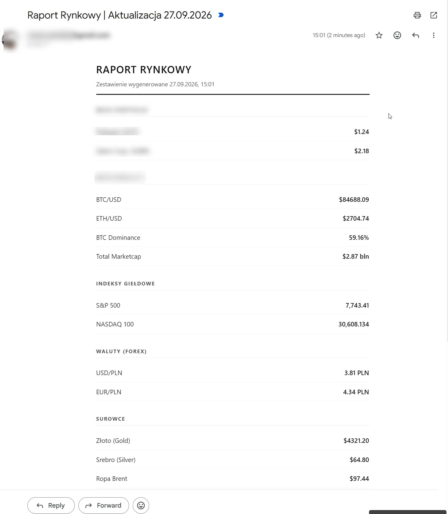
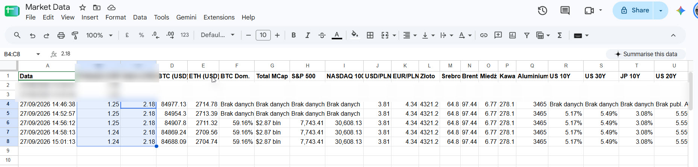

# Market Data Tracker & Reporter

A Google Apps Script automation tool to track and report selected financial assets. It fetches real-time market prices from free, public APIs, logs them into Google Sheets, and delivers a clean HTML report directly to your inbox.

## Key Features
* **No API Keys Required:** Uses only public, rate-friendly endpoints.
* **Automated Archiving:** Appends a new timestamped row with market prices to the active spreadsheet on each run.
* **Polished HTML Email Report:** Generates a clean, minimalist HTML email organized by asset class.
* **Error Resilience:** Built-in `try...catch` blocks safeguard against runtime failures if an API endpoint is temporarily unreachable (returning "No data").

## Tracked Assets & Data Sources
* **Coinbase API:** Polkadot (DOT), Bitcoin (BTC), Ethereum (ETH)
* **Yahoo Finance API:** Stocks (SABR), Currencies (USD/PLN, EUR/PLN), Commodities (Gold, Silver, Brent Crude, Copper, Coffee, Aluminum)
* **CoinLore API:** BTC Dominance, Total Crypto Market Cap
* **CNBC API:** Equity Indices (S&P 500, NASDAQ 100), Treasury Yields (US 10Y, US 20Y, US 30Y, Germany 10Y, Japan 10Y)

## Installation Guide
1. Open your Google Sheets spreadsheet.
2. In the top navigation menu, select **Extensions** ➔ **Apps Script**.
3. Clear any boilerplate code and paste the full contents of `Market Raport.js`.
4. Click the disk icon to save the project.
5. Click **Run**. On the initial run, Google will prompt for account authorization. Select your Google account, click *Advanced*, and select *Go to project (unsafe)*.

## Scheduled Automation Setup
To run the script automatically on a recurring schedule (e.g., weekly):
1. In the Apps Script editor, open the **Triggers** tab (clock icon in the left sidebar).
2. Click **+ Add Trigger** in the bottom-right corner.
3. Configure the trigger:
   * *Choose which function to run:* `checkMarketData`
   * *Select event source:* `Time-driven`
   * *Select type of time based trigger:* `Week timer`
   * *Select day of week:* e.g., `Monday`
   * *Select time of day:* e.g., `8am to 9am`
4. Click **Save**.

## Sheet Data Structure
The script appends gathered data to the next available row using `appendRow()`. Maintain the column ordering in your base worksheet once configured, as data is pushed sequentially (Timestamp, Crypto, Indices, Forex, Commodities, Bonds).

## Screenshots & Examples

### Market Report Email

### Market Data Google Sheet
