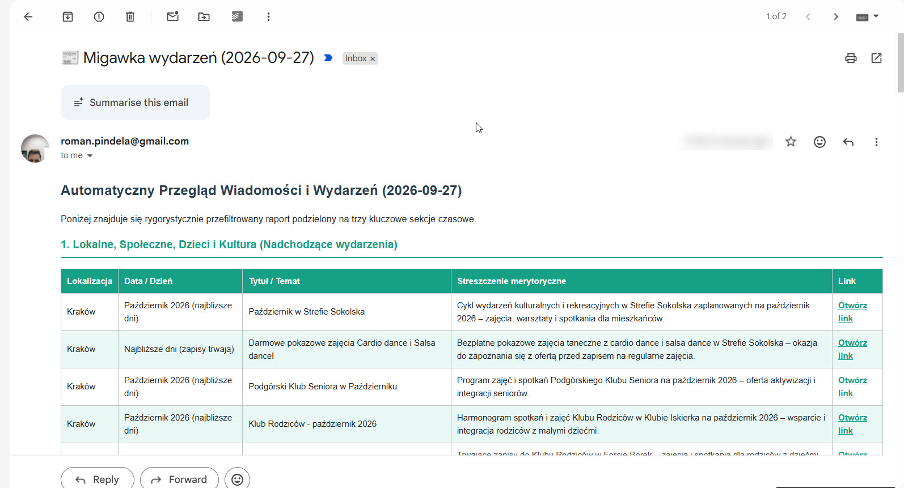

# RSS/Web News & Events Aggregator & LLM Filter

Automated system implemented in Google Apps Script that aggregates, intelligently filters, categorizes, and formats news and event data from predefined web sources using the **DeepSeek AI API**. The output is dynamically updated across three dedicated tabs in a Google Sheets workbook and dispatched as a clean, color-coded HTML summary report directly to your email.

---

## How It Works

1. **Web Scraping:** The script fetches raw HTML headers and links from trusted local and global source lists directly from their main pages[cite: 4].
2. **AI-Powered Filtering & Temporal Analysis:** Extracted raw text snippets, along with strict calendar boundaries (current date, past 7 days, next 7 days), are sent to the **DeepSeek AI API** (`deepseek-chat`)[cite: 4].
3. **Smart Categorization & Layout:**
   - **Section 1 (Local, Community, Children & Culture):** Filters exclusively for *upcoming* events within the next 7 days, sorted alphabetically by location[cite: 4].
   - **Section 2 (Global, Politics, Economy - Past):** Pulls significant factual updates and macro data from the *past 7 days* alongside exact article/event dates[cite: 4].
   - **Section 3 (Global, Politics, Economy - Future):** Extracts upcoming announcements and scheduled events for the *next 7 days* with target dates[cite: 4].
4. **Delivery & Formatting:** Clears and overwrites Google Sheets tabs automatically and sends an HTML digest via email with a dynamically generated date in the subject line (e.g., `📰 Migawka wydarzeń (YYYY-MM-DD)`)[cite: 4].

---

## Prerequisites

- A Google Account with access to Google Sheets and Google Apps Script[cite: 4].
- A valid **DeepSeek API Key** ([Get one here](https://platform.deepseek.com/))[cite: 4].

---

## Installation & Setup

1. **Create a Google Sheet:** Go to [sheets.google.com](https://sheets.google.com/) and create a new spreadsheet[cite: 4].
2. **Open Apps Script:** In your spreadsheet, click on **Extensions** > **Apps Script**[cite: 4].
3. **Add the Script:** Copy and paste the provided code into `Code.gs`[cite: 4].
4. **Configure Secure API Key (Script Properties):**
   - Click on **Project Settings** (gear icon on the left sidebar)[cite: 4].
   - Scroll down to **Script Properties** and click **Add script property**[cite: 4].
   - **Property:** `DEEPSEEK_API_KEY`[cite: 4]
   - **Value:** `your_deepseek_api_key_here`[cite: 4]
   - Click **Save script properties**[cite: 4].
5. **Run & Authorize:** Select the `generujRaportWiadomosci` function and click **Run** to grant necessary permissions[cite: 4].
6. **Automate (Triggers):** Go to **Triggers** (clock icon) and set up a time-driven trigger (e.g., daily or weekly) to run the script automatically in the background.

---

## Customization

You can easily adjust the monitored URLs by editing the `SOURCES_LOKALNE` and `SOURCES_GLOBALNE` arrays at the beginning of the `generujRaportWiadomosci` function[cite: 4]:

```javascript
const SOURCES_LOKALNE = [
  { url: "[https://your-source.pl/](https://your-source.pl/)", group: "Category/Region" },
  // Add more sources here...
];
```


## Screenshots & Examples

### Migawka Wydarzen


### Wydarzenia w arkuszu


### Apps Script Properties


### Migawka wydarzen email raport



Author & VersionAuthor: Roman Pindela (roman.pindela@gmail.com, GitHub)   Version: 1.2.0LicenseThis project is open-source and available for personal and commercial utilization.