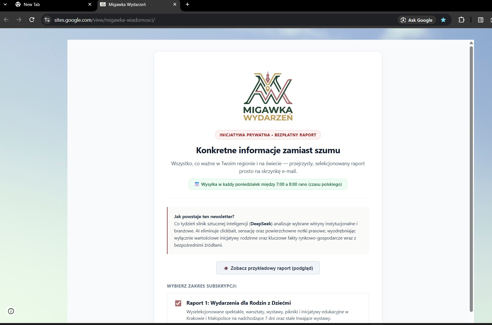
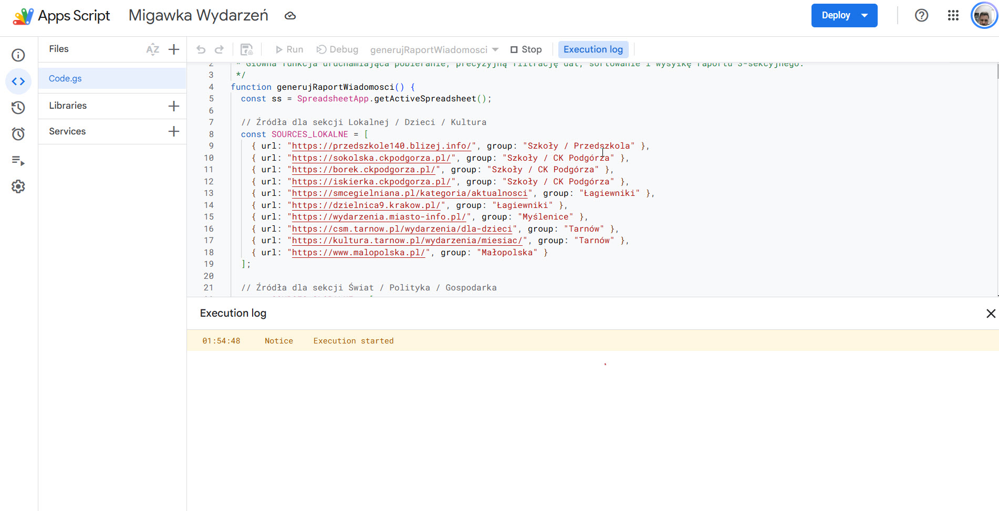
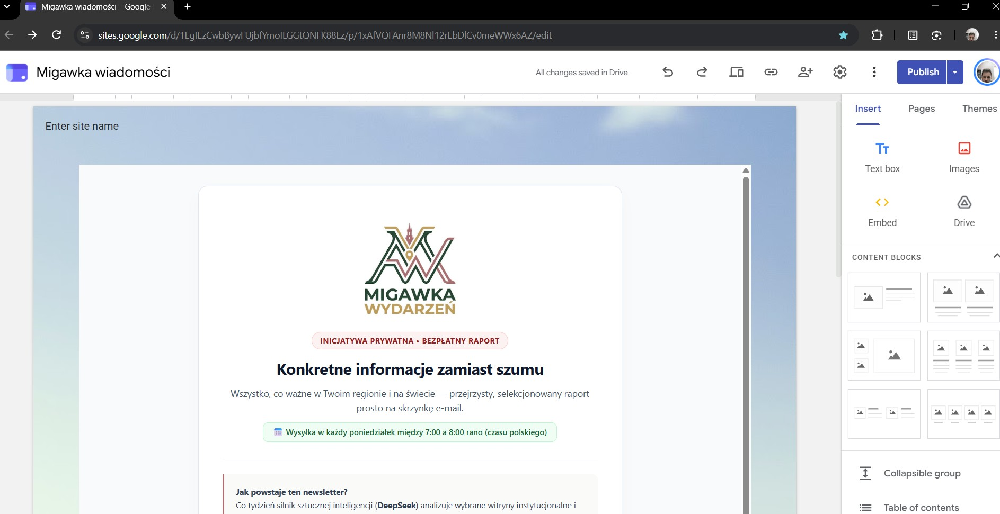
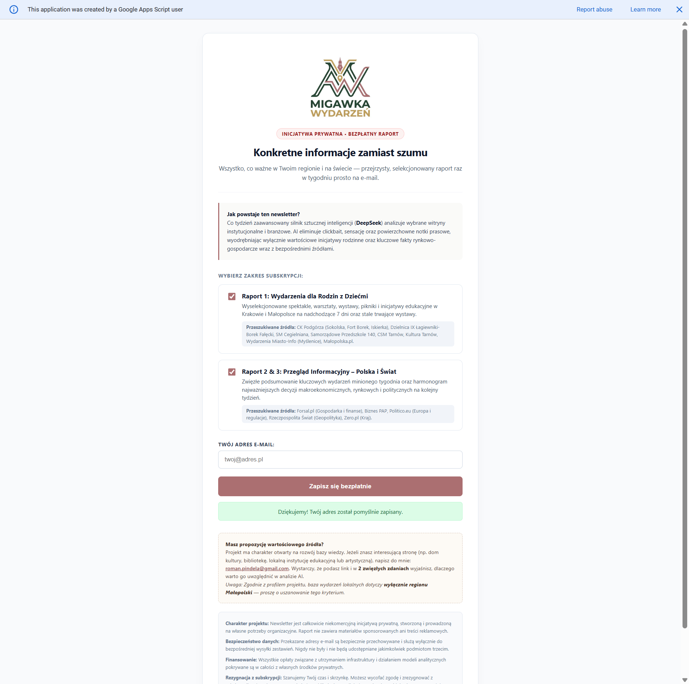
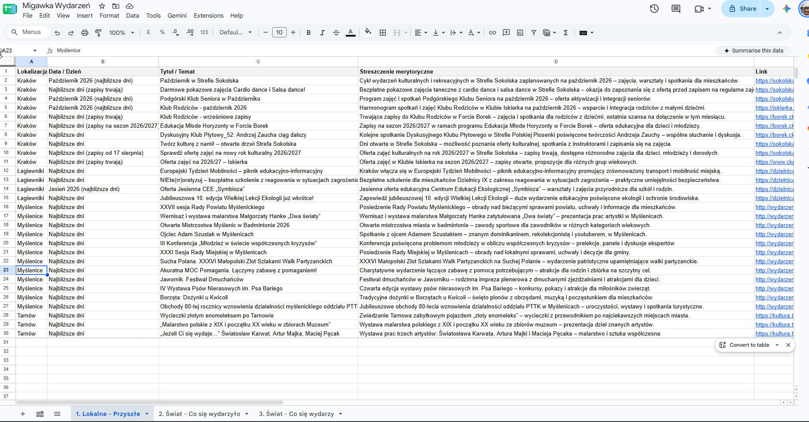
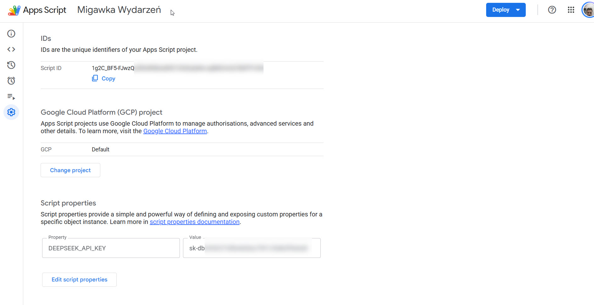
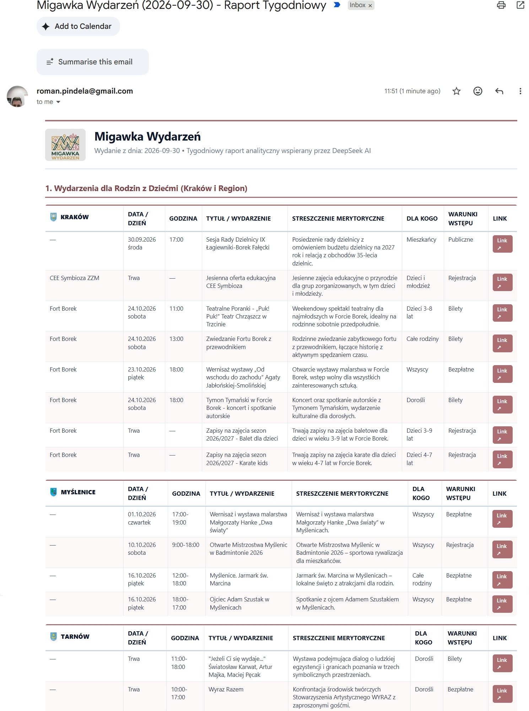

# Migawka Wydarzeń – RSS/Web News & Events Aggregator & LLM Filter

An automated, intelligent information aggregation, analytics, and distribution system built in **Google Apps Script**, powered by the **DeepSeek AI API** (`deepseek-chat`).

The system periodically monitors selected regional sources (Kraków, Myślenice, Tarnów, Lesser Poland) and global/national media (economy, finance, geopolitics), filters out informational noise and clickbait, organizes curated events in **Google Sheets**, and distributes responsive HTML newsletters to subscribers. The solution includes an integrated **Google Apps Script Web App** with a subscription form, report preference selection, unsubscribe handler, and Cloudflare Turnstile anti-bot verification.

---

## 🚀 Key Features

1. **Aggregation & Smart Web Scraping:**
   - Multi-threaded page fetching via `UrlFetchApp.fetchAll` with modern User-Agent emulation.
   - Robust HTML sanitization removing script and style tags while preserving absolute URLs.
2. **Advanced LLM Analytics (DeepSeek AI API):**
   - Precise calendar boundaries (current day, past 7 days, 7-day upcoming week schedule with days of the week).
   - Strict prompt profile eliminating clickbait and gossip — prioritizing substantive initiatives and macroeconomic decisions.
   - Enforced structural JSON output (`{"dane": [[...], [...]]}`) and `bezpiecznyParseJson` recovery logic in case of stream cutoffs.
3. **Three Thematic Report Sections:**
   - **Section 1: Family & Children Events (Kraków & Region):** ongoing exhibitions, upcoming performances, workshops, and weekend festivals for the next 7 days.
   - **Section 2: Past Week Summary (Poland, Europe, Global):** key macroeconomic indicators, central bank decisions (NBP, ECB, FED), fiscal policy, and geopolitics.
   - **Section 3: What's Ahead? (Upcoming Week):** calendar releases (CPI, GDP), interest rate decisions, and major economic announcements.
4. **Configuration & Data Management (Google Drive & Google Sheets):**
   - Sources loaded dynamically from JSON configuration files (`zrodla_lokalne.json`, `zrodla_globalne.json`) and `prompt_migawka_wydarzen.txt`.
   - Dedicated worksheet tabs updated in Google Sheets with styled headers, alternating rows, and auto-adjusted column widths.
5. **Email Distribution & Personalization:**
   - Subscriber preferences: recipients can choose family events only, world/market overview only, or the complete digest.
   - Dynamic inclusion of city crests and regional emblems from Google Drive into email layouts.
   - Secure one-click unsubscribe links in every newsletter footer.
6. **Web App Interface:**
   - Responsive subscription landing page in HTML5/CSS3 with interactive sample report modal preview.
   - Cloudflare Turnstile integration for bot protection.
   - Subscriber database maintained and updated in `emails.txt` on Google Drive.

---

## 🛠️ Google Drive Architecture

The script expects the following folder structure on Google Drive:

```text
Google Drive/
└── Automation/
    └── Migawka Wydarzeń/
        ├── emails.txt                  # Subscriber database (format: email;rodziny,swiat)
        ├── prompt_migawka_wydarzen.txt # DeepSeek prompt guidelines and profile filter
        ├── zrodla_lokalne.json         # Regional sources list (URLs, metadata)
        ├── zrodla_globalne.json        # Macroeconomic and global news sources list
        └── Brand/
            ├── Logo MW v2.jpg          # Project logo
            └── ikony_herby_i_symbole/
                └── JPG/                # City crests and emblems (01_herb_krakowa.jpg, etc.)
```

---

## ⚙️ Deployment & Configuration

### 1. Prerequisites
- Google Account with access to Google Sheets, Google Drive, and Google Apps Script.
- Active **DeepSeek API Key** ([platform.deepseek.com](https://platform.deepseek.com/)).
- (Optional) **Cloudflare Turnstile** site and secret keys for form bot protection.

### 2. Configure Script Properties
In Apps Script editor, open **Project Settings** (gear icon) > **Script Properties** and add:

| Property | Value |
| :--- | :--- |
| `DEEPSEEK_API_KEY` | Your DeepSeek API key (`sk-...`) |
| `CAPTCHA_SITE_KEY` | *(Optional)* Cloudflare Turnstile public site key |
| `CAPTCHA_SECRET_KEY` | *(Optional)* Cloudflare Turnstile secret key |

### 3. Deploy as Web App
1. In the upper-right corner of Apps Script, click **Deploy** > **New deployment**.
2. Select type: **Web app**.
3. **Execute as:** *Me (your email address)*.
4. **Who has access:** *Anyone*.
5. The deployment URL handles GET requests (subscription page, unsubscribe links) and POST requests (new email signups).

### 4. Automated Scheduling (Triggers)
In the **Triggers** menu (clock icon), add a time-driven trigger for `generujRaportWiadomosci`:
- Event source: **Time-driven**
- Trigger type: **Week timer** (e.g., every Monday between 7:00 AM and 8:00 AM).

---

## 🖼️ Screenshots

### Google Sites Publication


### Project Overview – Migawka Wydarzeń


### Google Sites Website


### Newsletter Subscription Form


### Managing Deployments


### Unsubscribe Confirmation


### Google Sheets Overview


### Script Properties in Google Apps Script


### Finished Email Report in Gmail


---

## 👤 Author Information

- **Author:** Roman Pindela
- **Email:** [roman.pindela@gmail.com](mailto:roman.pindela@gmail.com)
- **GitHub:** [roman-pindela](https://github.com/roman-pindela)
- **Version:** 2.2.2

---

## 📄 License

This project is licensed under the **MIT License**. Code may be freely adapted, modified, and deployed for commercial and private use.