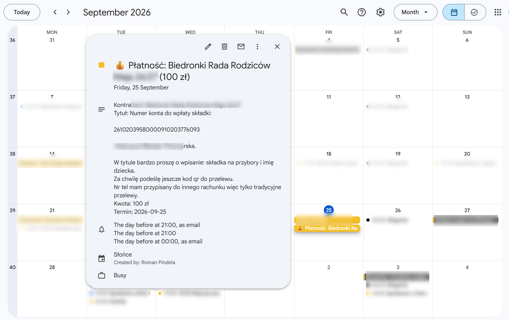
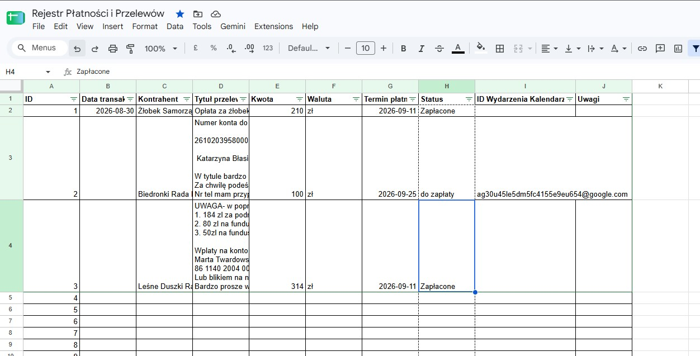

# Rejestr Płatności i Przelewów – Integracja Google Sheets z Google Calendar

Skrypt zawarty w pliku `Rejestr-płatności-i-przelewow.txt` to narzędzie automatyzujące zarządzanie płatnościami. Jego głównym zadaniem jest synchronizacja danych wprowadzanych w arkuszu Google Sheets z wybranym Kalendarzem Google.

## Co to jest i jak to działa?

Skrypt Google Apps Script odczytuje dane z aktywnego arkusza kalkulacyjnego i na ich podstawie zarządza wydarzeniami w kalendarzu. Działa on według następującej logiki:

1. **Identyfikacja kolumn:** Skrypt automatycznie wykrywa odpowiednie kolumny na podstawie ich nagłówków (ignorując wielkość liter oraz polskie znaki), co daje elastyczność w budowaniu tabeli.
2. **Dodawanie wydarzeń (Do zapłaty):** Jeśli wiersz ma przypisany status **"do zapłaty"** oraz określoną datę płatności, skrypt tworzy w kalendarzu nowe, całodniowe wydarzenie.
   * Tytuł wydarzenia to np.: `💰 Płatność: [Kontrahent] ([Kwota] [Waluta])`.
   * Opis wydarzenia zawiera szczegóły: nazwę kontrahenta, tytuł przelewu, kwotę z walutą oraz termin płatności.
   * Skrypt zapisuje unikalne ID utworzonego wydarzenia z powrotem w arkuszu (w odpowiedniej kolumnie), aby nie duplikować wpisów przy kolejnym uruchomieniu.
3. **Usuwanie wydarzeń (Zapłacone / Anulowane):** Kiedy zmienisz status płatności w arkuszu na **"zapłacone"**, **"opłacone"** lub **"anulowane"**, skrypt odszuka odpowiednie wydarzenie za pomocą przypisanego ID i usunie je z kalendarza, oczyszczając w ten sposób Twój harmonogram z załatwionych już spraw. Następnie czyści pole ID w arkuszu.
4. **Rozpoznawanie dat:** Wbudowana funkcja radzi sobie z różnymi formatami daty (np. wpisy z użyciem kropek, myślników lub ukośników w formacie DD.MM.YYYY).

## Wymagana struktura arkusza (Kolumny)

Aby skrypt z pliku `Rejestr-płatności-i-przelewow.txt` działał poprawnie, pierwszy wiersz arkusza musi zawierać nagłówki o następujących nazwach (kolejność jest dowolna, wielkość liter nie ma znaczenia):

* `kontrahent`
* `tytul przelewu`
* `kwota`
* `waluta`
* `termin platnosci`
* `status` (Dopuszczalne wartości uruchamiające akcje: *do zapłaty, zapłacone, zapłacona, opłacone, opłacona, anulowane, anulowana*)
* `id wydarzenia kalendarza` (W tej kolumnie skrypt automatycznie zapisuje ID wygenerowanych zdarzeń. Nie edytuj jej ręcznie!)

## Pełna instrukcja uruchomienia

### Krok 1: Przygotowanie Kalendarza Google
1. Wejdź w swój Kalendarz Google.
2. Możesz utworzyć nowy kalendarz (np. "Płatności") lub wykorzystać swój dedykowany.
3. Przejdź do **Ustawień** wybranego kalendarza.
4. Zjedź w dół do sekcji **Integrowanie kalendarza**.
5. Skopiuj **Identyfikator kalendarza** (będzie miał format np. `c_costam12345@group.calendar.google.com` lub po prostu Twój adres Gmail dla kalendarza głównego).

### Krok 2: Konfiguracja Skryptu
1. Otwórz swój plik Google Sheets, w którym masz tabelę płatności (zgodną z opisanymi wyżej nagłówkami).
2. W górnym menu wybierz **Rozszerzenia** -> **Apps Script**.
3. Wyczyść domyślny kod i wklej tam całą zawartość z pliku `Rejestr-płatności-i-przelewow.txt`.
4. **BARDZO WAŻNE:** W pierwszej linijce kodu znajdź fragment:
   ```javascript
   const CALENDAR_ID = 'IDKALENDARZADOUZUPELNIENIA@group.calendar.google.com';
   ```
   Zastąp `IDKALENDARZADOUZUPELNIENIA@group.calendar.google.com` skopiowanym w Kroku 1 Identyfikatorem kalendarza.
5. Zapisz projekt (ikona dyskietki lub `Ctrl+S`).

### Krok 3: Pierwsze uruchomienie i autoryzacja
1. W edytorze Apps Script na górnym pasku upewnij się, że wybrana jest funkcja `syncPaymentsToCalendar`.
2. Kliknij przycisk **Uruchom**.
3. Google poprosi o autoryzację dostępu. Postępuj zgodnie z instrukcjami:
   * Kliknij *Sprawdź uprawnienia*.
   * Wybierz swoje konto Google.
   * Zobaczysz ostrzeżenie, że aplikacja nie jest zweryfikowana – kliknij *Zaawansowane*, a następnie *Przejdź do projektu (niebezpieczne)*.
   * Kliknij *Zezwól*.

### Krok 4: Automatyzacja (Opcjonalnie)
Aby nie klikać "Uruchom" za każdym razem, możesz ustawić przycisk bezpośrednio w arkuszu lub automatyczny wyzwalacz:
* **Wyzwalacz czasowy:** W edytorze Apps Script po lewej stronie kliknij ikonę zegara ("Wyzwalacze"). Kliknij "Dodaj regułę", wybierz funkcję `syncPaymentsToCalendar`, rodzaj zdarzenia na podstawie czasu, np. co godzinę lub raz dziennie.
* **Przycisk w arkuszu:** W menu arkusza wybierz *Wstaw* -> *Rysunek*, stwórz prosty przycisk (np. "Synchronizuj"). Zapisz i zamknij. Kliknij na stworzony rysunek prawym przyciskiem, wybierz trzy kropki, kliknij *Przypisz skrypt* i wpisz nazwę funkcji: `syncPaymentsToCalendar`.

---


## ScreenShots

### Kalendarz Google - wydarzenie stworzone automatyczne z tabeli gsheet


### Tabela w formacie gsheet


## Autor i Wersja

* **Autor:** Roman Pindela
* **Email:** [roman.pindela@gmail.com](mailto:roman.pindela@gmail.com)
* **GitHub:** [@romanpindela](https://github.com/romanpindela)
* **Wersja:** 1.0.0