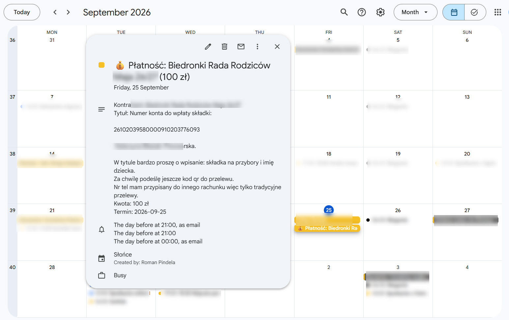
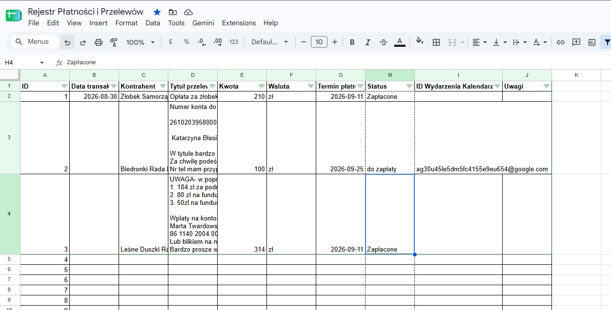
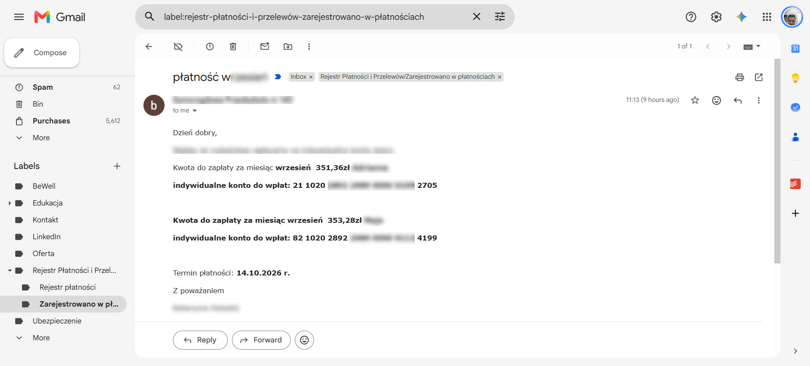
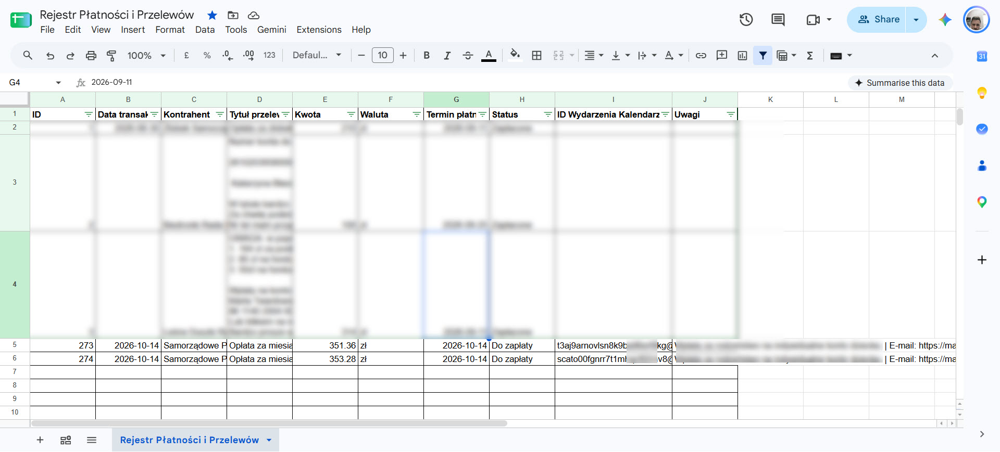

# Payment & Transfer Tracker – Google Sheets, Google Calendar & Gmail AI Integration

A comprehensive automation tool managing personal and business payments. It unites Gmail inbox messages, Google Sheets, and Google Calendar into a cohesive tracking workflow.

---

## Core System Modules

### 1. Smart Payment Parsing from Email (Gmail + Gemini AI + Fallback)
The script searches labeled Gmail threads and appends new rows into the payment ledger:
* **Label Detection:** Processes messages tagged with `Rejestr Płatności i Przelewów/Rejestr płatności`.
* **Gemini AI Extraction:** Leverages Google Gemini models to extract structured data from unformatted text (amounts, payees, transfer descriptions, dedicated account numbers, due dates).
* **Multi-Item Support:** Automatically splits multi-item bills (e.g. tuition fees for multiple children) into separate table rows.
* **Custom Forwarding Notes:** Allows forwarding emails to yourself with custom notes (e.g., *"due date: 10th of every month"*), which the AI incorporates into date calculations.
* **Direct Email Deep-Linking:** Automatically writes a clickable link leading directly to the source Gmail conversation in the `Notes` column.
* **Resilient Fallback Engine:** If API limits are reached (503/429 errors), the script switches to heuristic regex rules, ensuring zero missed payments.
* **Duplicate Prevention:** Upon successful logging, the input label is removed and replaced by `Rejestr Płatności i Przelewów/Zarejestrowano w płatnościach`.

### 2. Bidirectional Google Calendar Sync
Manages calendar events based on payment statuses:
* **"To pay" Entries:** Creates an all-day event in the calendar with reminder notifications and stores the `Calendar Event ID` in the sheet.
* **"Paid" / "Cancelled" Entries:** Removes the linked calendar event, freeing up the schedule.
* **Column Flexibility:** Column lookups are case-insensitive and accent-insensitive.

---

## Required Sheet Columns

The spreadsheet header row must include the following column titles:

* `ID`
* `Transaction Date`
* `Payee`
* `Transfer Title`
* `Amount`
* `Currency`
* `Due Date`
* `Status` (*To pay, Paid, Cancelled*)
* `Calendar Event ID` (auto-managed by script)
* `Notes` (AI summary and Gmail thread link)

---

## Installation & Setup

### Step 1: Set up Gmail Labels
Create the nested label hierarchy in Gmail:
1. Parent Label: `Rejestr Płatności i Przelewów`
2. Intake Label: `Rejestr Płatności i Przelewów/Rejestr płatności`
3. Archive Label: `Rejestr Płatności i Przelewów/Zarejestrowano w płatnościach`

*(Optional)* Configure a Gmail filter: if an incoming or forwarded email contains `#rejestr`, apply label `Rejestr Płatności i Przelewów/Rejestr płatności`.

### Step 2: Configure Google Calendar
1. Open Google Calendar **Settings**.
2. Under **Integrate calendar**, copy your **Calendar ID**.

### Step 3: Configure Apps Script Code
1. Open your payments Google Sheet.
2. Select **Extensions** ➔ **Apps Script**.
3. Paste the project source code.
4. Set configuration constants:
   * `CALENDAR_ID` – your target calendar ID.
   * `GEMINI_API_KEY` – your API key from [Google AI Studio](https://aistudio.google.com/).
5. Save the project (`Ctrl + S`).

### Step 4: Authorization & Triggers
1. Select function `przetworzOznaczonePlatnosci` and click **Run**. Grant requested Google permissions.
2. Go to **Triggers** (clock icon):
   * Add trigger for `przetworzOznaczonePlatnosci` (time-driven: every 10–15 minutes).
   * Add trigger for `syncPaymentsToCalendar` (time-driven: once an hour or once daily).

---

## Screenshots

### Google Calendar Event

### Payments Google Sheet Table

### Transfer Details in Email

### Processed Payments Extracted from Email

---

## Author & Version

* **Author:** Roman Pindela
* **Email:** [roman.pindela@gmail.com](mailto:roman.pindela@gmail.com)
* **GitHub:** [@romanpindela](https://github.com/romanpindela)
* **Version:** 1.7.0