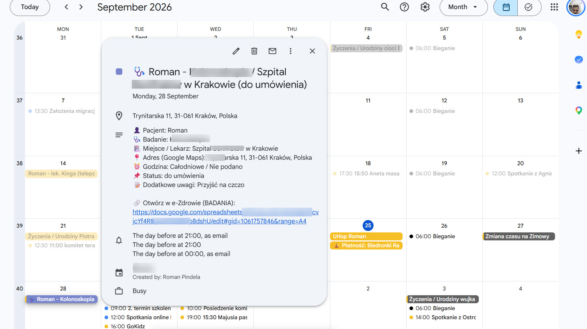
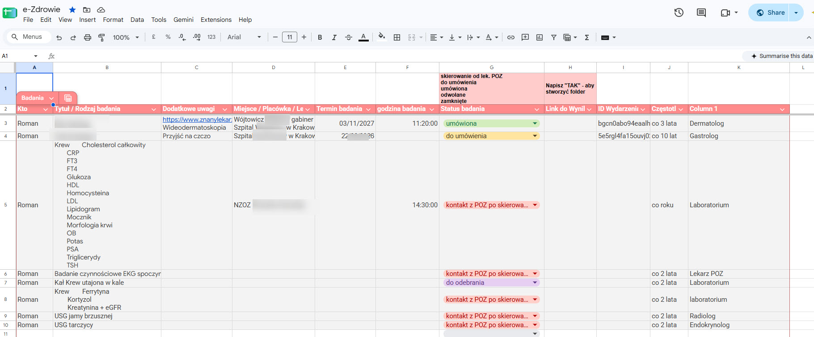

# Rejestr Badań Okresowych – Dwukierunkowa Synchronizacja: Google Sheets ↔ Google Calendar

Skrypt zawarty w pliku Rejestr badań okresowych.txt to zaawansowane narzędzie automatyzujące zarządzanie badaniami lekarskimi i wizytami. Głównym zadaniem jest **dwukierunkowa synchronizacja** danych wprowadzanych w arkuszu Google Sheets ("e-Zdrowie") z wybranym Kalendarzem Google (np. "Słońce").

## Co to jest i jak to działa?

Skrypt Google Apps Script odczytuje dane z arkusza kalkulacyjnego i tworzy/aktualizuje wydarzenia w kalendarzu, a także potrafi aktualizować arkusz na podstawie zmian wprowadzonych bezpośrednio w kalendarzu.

Działa on według następującej logiki:

1.  **Edycja w Arkuszu (Kierunek 1):** Gdy edytujesz wiersz w arkuszu, skrypt automatycznie odczytuje dane.
    *   Jeśli wpiszesz datę badania i tytuł, tworzy nowe wydarzenie w Kalendarzu Google.
    *   Wydarzenie zawiera szczegóły: Kto (pacjent), Rodzaj badania, Miejsce, Datę i Godzinę (lub jest całodniowe), Status, Uwagi oraz bezpośredni link do wiersza w arkuszu e-Zdrowie.
    *   Dynamicznie przypisuje emotikony (ikony) w zależności od rodzaju badania (np. 🩸 dla krwi, 🦷 dla stomatologa, 🩺 dla USG/RTG).
    *   Status badania (np. "zamknięte", "odwołane") zmienia kolor wydarzenia w kalendarzu (wyszarza je).
    *   Skrypt automatycznie przypisuje adres do pola lokalizacji za pomocą geokodowania Google Maps na podstawie nazwy placówki/lekarza.
    *   **Generowanie Folderu na Wyniki:** Jeśli w kolumnie "Link do Wyników" wpiszesz "Tak", skrypt utworzy w Google Drive folder o nazwie `YYYY.MM.DD - [Pacjent] - [Badanie] - [Placówka]` i podmieni wpis na link do tego folderu.
    *   Wpisanie pustej daty w arkuszu automatycznie **usuwa** powiązane wydarzenie z kalendarza.
    *   Skrypt zapisuje unikalne ID wydarzenia w kolumnie `ID Wydarzenia`, zapobiegając duplikatom.

2.  **Zmiana w Kalendarzu (Kierunek 2):** Funkcja `syncFromCalendarToSheet` sprawdza wydarzenia w kalendarzu na podstawie zapisanych ID.
    *   Jeśli zmienisz datę lub godzinę wydarzenia bezpośrednio w Kalendarzu Google, skrypt po uruchomieniu zaktualizuje odpowiednie komórki (Termin i Godzinę) w Twoim arkuszu.
    *   Jeśli usuniesz wydarzenie z kalendarza, skrypt usunie powiązane ID z arkusza.

## Wymagana struktura arkusza (Kolumny)

Skrypt oczekuje ściśle określonej kolejności kolumn. Arkusz (najlepiej o nazwie "BADANIA", ale można to zmienić w konfiguracji) musi posiadać nagłówki. Dane pobierane są według poniższych numerów kolumn:

*   **Kolumna 1 (A):** Kto (Imię pacjenta, np. Roman)
*   **Kolumna 2 (B):** Tytuł / Rodzaj badania
*   **Kolumna 3 (C):** Dodatkowe uwagi (np. "Przyjść na czczo")
*   **Kolumna 4 (D):** Miejsce / Placówka / Lekarz
*   **Kolumna 5 (E):** Termin badania (Data)
*   **Kolumna 6 (F):** godzina badania
*   **Kolumna 7 (G):** Status badania (np. umówiona, do umówienia, zamknięte, odwołane)
*   **Kolumna 8 (H):** Link do Wyników (Wpisz "Tak", aby wygenerować folder, lub podaj gotowy link)
*   **Kolumna 9 (I):** ID Wydarzenia (Pole uzupełniane automatycznie przez skrypt)

Zrzut ekranu `Tabela_badań.jpg` w repozytorium przedstawia poprawny układ arkusza. Zrzut ekranu `Kalendarz_z_badaniem.jpg` pokazuje, jak szczegółowo wygenerowane jest wydarzenie w kalendarzu.

## Pełna instrukcja uruchomienia

### Krok 1: Przygotowanie Kalendarza Google

1.  Wejdź w swój Kalendarz Google.
2.  Znajdź kalendarz (np. "Słońce").
3.  Przejdź do **Ustawień** wybranego kalendarza.
4.  Zjedź w dół do sekcji **Integrowanie kalendarza**.
5.  Skopiuj **Identyfikator kalendarza** (np. `c_xyz123@group.calendar.google.com`).

### Krok 2: Konfiguracja Skryptu w Arkuszu

1.  Otwórz swój plik Google Sheets (np. e-Zdrowie).
2.  W górnym menu wybierz **Rozszerzenia** -> **Apps Script**.
3.  Wyczyść domyślny kod i wklej tam całą zawartość z pliku `Rejestr badań okresowych.txt`.
4.  W pierwszych linijkach kodu znajdź obiekt `CONFIG`:
    ```javascript
    const CONFIG = {
      SHEET_NAME: 'BADANIA', // Zmień, jeśli Twój arkusz nazywa się inaczej
      CALENDAR_ID: 'IDKALENDARZA@group.calendar.google.com', // TUTAJ WKLEJ SKOPIOWANE ID
    // ...
    ```
5.  Zastąp `IDKALENDARZA@group.calendar.google.com` swoim identyfikatorem kalendarza skopiowanym w Kroku 1.
6.  Zapisz projekt (ikona dyskietki lub `Ctrl+S`).

### Krok 3: Konfiguracja Wyzwalaczy (Triggers) – Bardzo Ważne!

Aby skrypt działał automatycznie przy każdej edycji oraz potrafił synchronizować zmiany z kalendarza, musisz ustawić tzw. Wyzwalacze (Triggers).

1.  W edytorze Apps Script po lewej stronie kliknij ikonę zegara (**Wyzwalacze**).
2.  Kliknij **Dodaj regułę** (w prawym dolnym rogu).

**Wyzwalacz 1: Aktualizacja przy edycji Arkusza (Arkusz -> Kalendarz)**
*   Wybierz funkcję: `syncRowToCalendar`
*   Wybierz wdrożenie: `Główny`
*   Wybierz źródło zdarzenia: `Z arkusza kalkulacyjnego`
*   Wybierz typ zdarzenia: `Przy edycji`
*   Kliknij **Zapisz** i nadaj uprawnienia (Autoryzuj aplikację).

**Wyzwalacz 2: Synchronizacja zmian z Kalendarza (Kalendarz -> Arkusz)**
*   Kliknij ponownie **Dodaj regułę**.
*   Wybierz funkcję: `syncFromCalendarToSheet`
*   Wybierz wdrożenie: `Główny`
*   Wybierz źródło zdarzenia: `Oparte na czasie`
*   Wybierz typ wyzwalacza oparty na czasie: `Wyzwalacz godzinny`
*   Wybierz odstęp czasu (w godzinach): np. `Co godzinę` (lub inną preferowaną częstotliwość).
*   Kliknij **Zapisz**.

---


## ScreenShots

### Kalendarz Google z badaniem


### Tabela badań w formacie gsheet



## Autor i Wersja

*   **Autor:** Roman Pindela
*   **Email:** [roman.pindela@gmail.com](mailto:roman.pindela@gmail.com)
*   **GitHub:** [@romanpindela](https://github.com/romanpindela)
*   **Wersja:** 1.0.0
