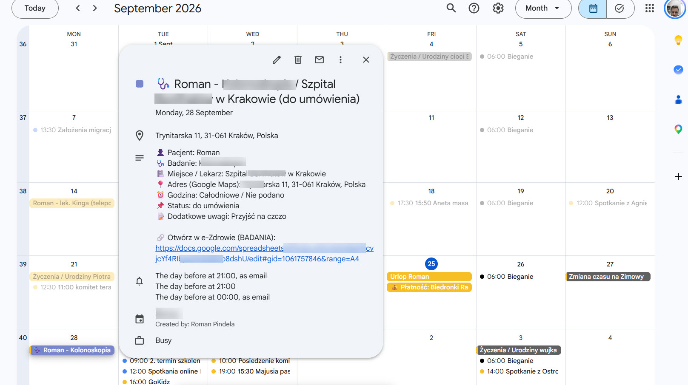
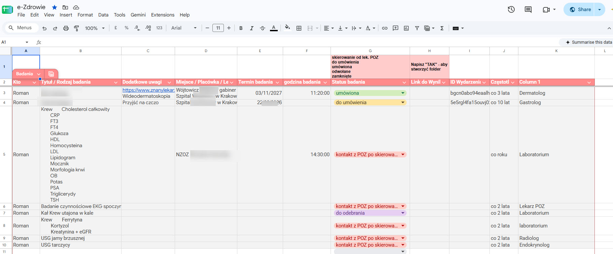

# Medical Checkup Tracker – Bidirectional Sync: Google Sheets ↔ Google Calendar

The script provided in `Rejestr badań okresowych.txt` is an advanced automation tool for managing medical appointments and checkups. Its primary purpose is **bidirectional synchronization** between a Google Sheets spreadsheet ("e-Health") and a selected Google Calendar (e.g. "Family Calendar").

## Overview & Workflow

The Google Apps Script reads records from the spreadsheet, creates/updates calendar events, and synchronizes calendar edits back to the sheet.

1. **Spreadsheet Edits (Direction 1: Sheet ➔ Calendar):** When editing a row in the sheet, the script reads data:
   * Specifying an appointment date and title creates a new event in Google Calendar.
   * Events include detailed metadata: Patient, Exam Type, Location, Date & Time (or all-day), Status, Notes, and a direct link to the spreadsheet row.
   * Dynamically assigns contextual emoji icons based on medical specialty (e.g., 🩸 for blood tests, 🦷 for dental, 🩺 for ultrasound/X-ray).
   * Appointment status (e.g., "completed", "cancelled") color-codes the calendar event (greying out cancelled/completed visits).
   * Automatically resolves and attaches street addresses via Google Maps geocoding from clinic or doctor names.
   * **Results Folder Provisioning:** Entering "Yes" into "Results Link" prompts the script to generate a dedicated Google Drive folder formatted as `YYYY.MM.DD - [Patient] - [Exam] - [Clinic]` and updates the cell with the folder link.
   * Clearing the date field automatically **removes** the linked calendar event.
   * Stores unique calendar IDs in `Event ID` column to eliminate duplicates.

2. **Calendar Edits (Direction 2: Calendar ➔ Sheet):** The `syncFromCalendarToSheet` function audits events by stored IDs.
   * Rescheduling an event date or time in Google Calendar automatically updates the respective cells (Date and Time) in your sheet.
   * Deleting an event in Google Calendar removes the linked ID from the spreadsheet.

## Required Sheet Schema (Columns)

The script relies on a predefined column order. The worksheet (recommended title: `BADANIA`, configurable in code) requires the following column structure:

* **Column 1 (A):** Patient Name
* **Column 2 (B):** Exam Title / Type
* **Column 3 (C):** Additional Notes (e.g., "Fasting required")
* **Column 4 (D):** Facility / Clinic / Doctor
* **Column 5 (E):** Appointment Date
* **Column 6 (F):** Appointment Time
* **Column 7 (G):** Appointment Status (e.g., scheduled, to be scheduled, completed, cancelled)
* **Column 8 (H):** Results Link (Enter "Yes" to auto-provision folder, or paste custom URL)
* **Column 9 (I):** Event ID (Auto-populated by script)

## Setup Guide

### Step 1: Prepare Google Calendar
1. Open Google Calendar.
2. Select your target calendar.
3. Open **Settings and sharing**.
4. Scroll down to **Integrate calendar**.
5. Copy the **Calendar ID** (e.g. `c_xyz123@group.calendar.google.com`).

### Step 2: Configure Apps Script in Google Sheets
1. Open your Google Sheet.
2. Go to **Extensions** ➔ **Apps Script**.
3. Replace existing code with the contents of `Rejestr badań okresowych.txt`.
4. Locate the `CONFIG` object at the top of the file:
   ```javascript
   const CONFIG = {
     SHEET_NAME: 'BADANIA', // Change if your sheet uses a different name
     CALENDAR_ID: 'YOUR_CALENDAR_ID@group.calendar.google.com', // Paste copied ID here
   // ...
   ```
5. Replace the placeholder with your actual Calendar ID.
6. Save the project (`Ctrl+S`).

### Step 3: Configure Automation Triggers
1. In the Apps Script sidebar, click the clock icon (**Triggers**).
2. Click **+ Add Trigger** (bottom right).

**Trigger 1: Sheet Edits (Sheet ➔ Calendar)**
* Choose function: `syncRowToCalendar`
* Deployment: `Head`
* Event source: `From spreadsheet`
* Event type: `On edit`
* Click **Save** and grant account permissions.

**Trigger 2: Calendar Sync (Calendar ➔ Sheet)**
* Click **+ Add Trigger**.
* Choose function: `syncFromCalendarToSheet`
* Deployment: `Head`
* Event source: `Time-driven`
* Type: `Hour timer`
* Interval: `Every hour`
* Click **Save**.

---

## Screenshots

### Google Calendar Event


### Medical Registry Google Sheet


---

## Author & Version

* **Author:** Roman Pindela
* **Email:** [roman.pindela@gmail.com](mailto:roman.pindela@gmail.com)
* **GitHub:** [@romanpindela](https://github.com/romanpindela)
* **Version:** 1.0.0
